## 常见问题
### 1. 如何获取最新的固件
可以从以下连接获取最新的Bootloader，固件以及部分模型文件
[https://github.com/Seeed-Studio/Seeed_Arduino_GroveAI/releases](https://github.com/Seeed-Studio/Seeed_Arduino_GroveAI/releases)
### 2. 设备的串口波特率
```info
921600
```
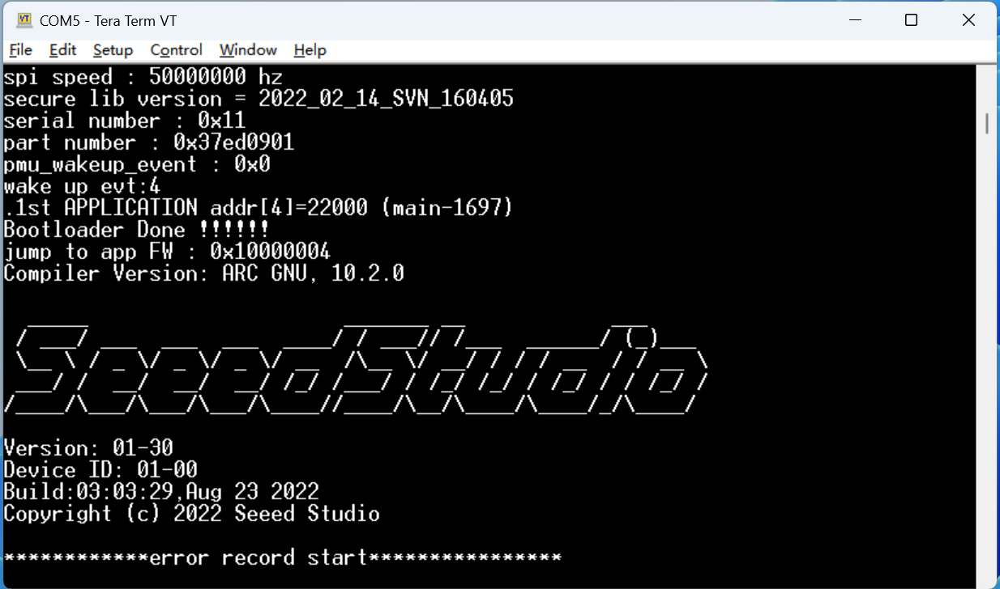
### 3. 更新Bootloader
> BL702作为辅助芯片实现了升级固件，烧录模型，串口转发的功能，强烈建议升级到最新的版本以获得更稳定的体验，如果您的设备的Bootloader已经是最新版本，就无需升级。

- 查看版本信息
   - 双击`BOOT`按钮，等待可移动硬盘挂载
   - 打开可移动硬盘中INFO_UF2.TXT

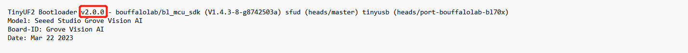
示例中的版本为 v2.0.0 

- 下载并安装BLDevCube软件
   - 打开 [https://dev.bouffalolab.com/download](https://dev.bouffalolab.com/download)


- 按照以下操作进入烧录界面
   - 打开之前安装的`Bouffalo Lab Dev Cube`，选择`BL702/704/706`, 点击`Finish`完成选择

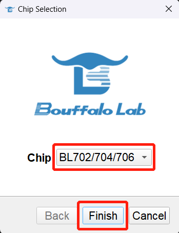

   - 选择`MCU`标签页，在`Image File`打开`Browse`选择固件

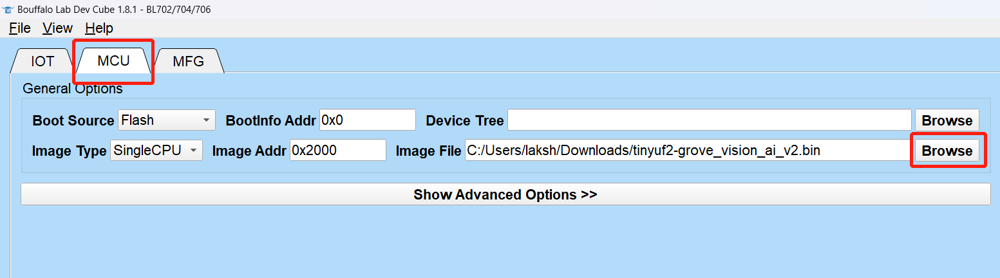

- 按住`Boot`按键同时通过Type-C连接设备

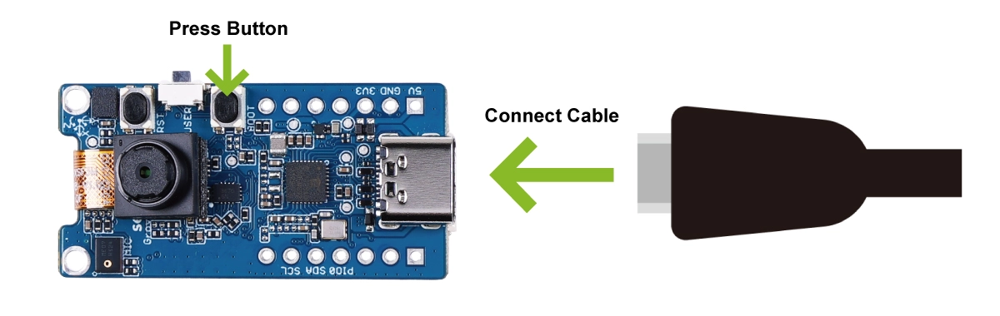

- 刷新设备并选择对应串口，点击 `Create & Download`开始烧录固件

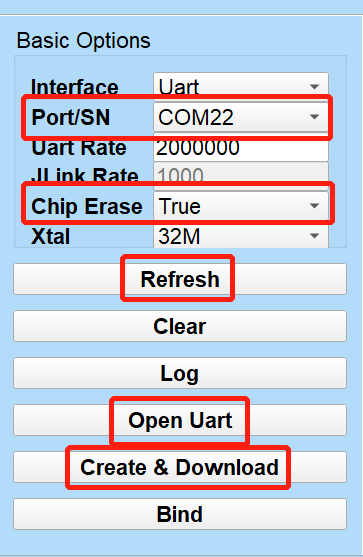

- 当你成功后，你可以看到以下的提示
- 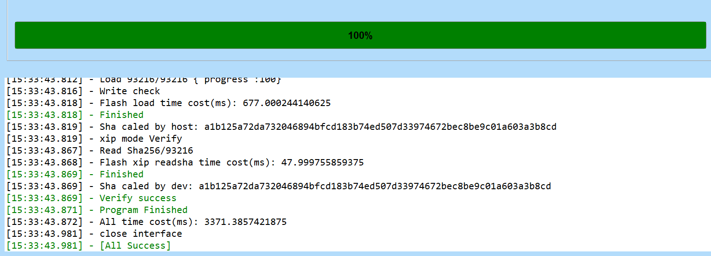
### 4. 更新固件

- 使用Type-C连接PC与Grove Vision AI
- 双击`Grove Vision AI`上`Boot`按键进入`Bootloader`

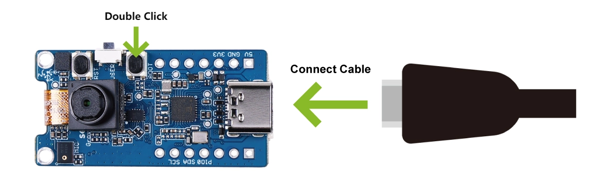

- PC上出现名为`GROVE`的可移动存储介质

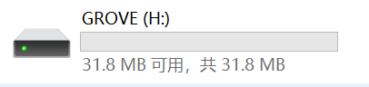

- 将对应的.UF2固件复制到该可移动存储介质


- 等待拷贝完成，`Grove Vision AI`重启
### 5. 烧录模型
与更新固件方式一致
### 6. 无法启动
有时烧录了错误的固件，会导致设备无法正常启动，具体的表现形式为，通过USB连接到PC后，打开相应的串口，此时按下复位按钮，发现串口无数据打印。正常启动的板子会有启动日志。修复方法如下
- 按复位后正常启动日志
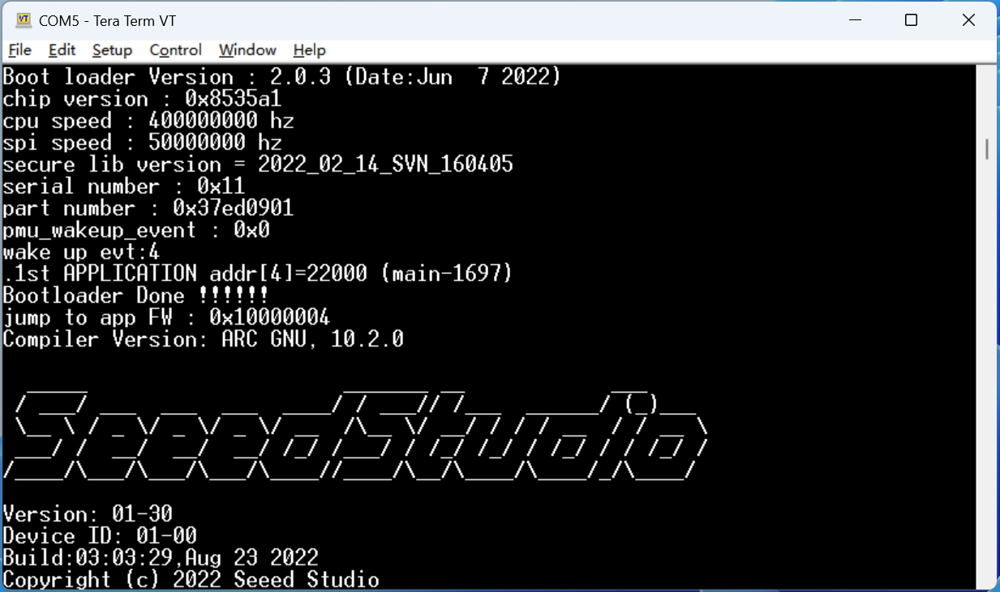
- 按复位后无日志打印
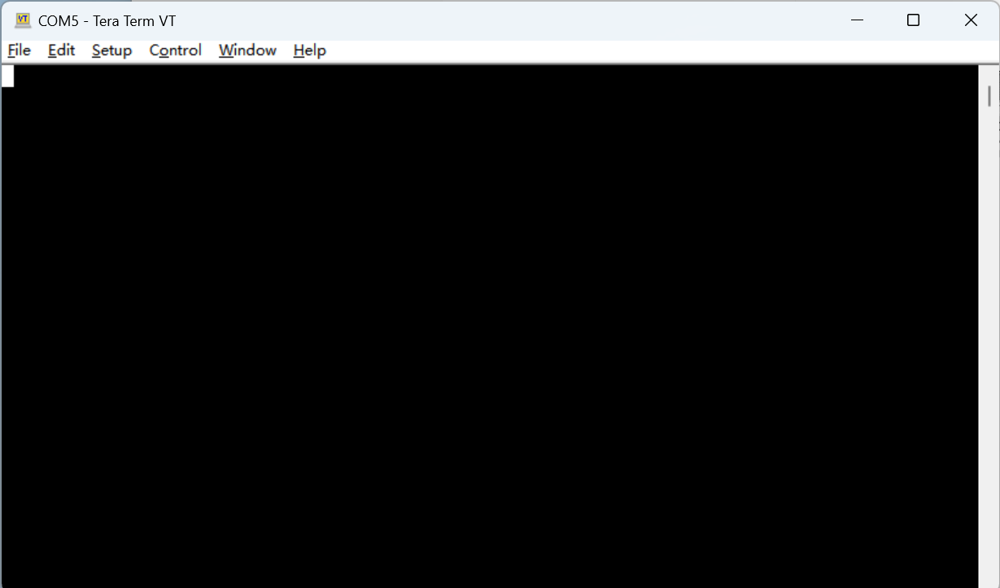

- 将设备通过I2C与Arduion 板子连接

这里推荐使用Seeeduino XIAO系列，或者Wio Terminal

- 同时将`Vision AI`设备和`Arduino设备`连接到PC
- 打开`Vision AI`的串口
- 烧录修复程序到Arduino板子并打开Arduino板子的串口

    [https://github.com/Seeed-Studio/Seeed_Arduino_GroveAI/tree/master/examples/erase](https://github.com/Seeed-Studio/Seeed_Arduino_GroveAI/tree/master/examples/erase)

出现以下信息代表修复程序运行成功
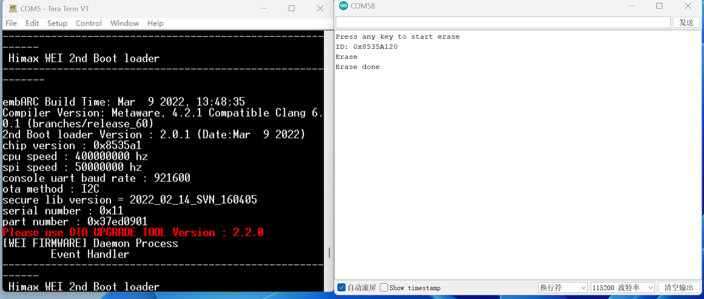

- 通过更新正确固件就可以正常启动

